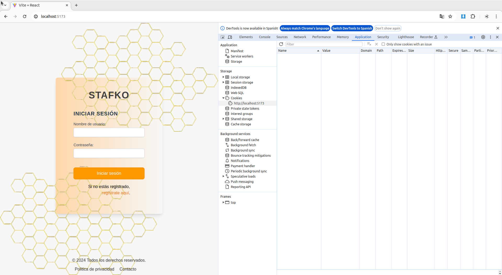

# STAFKO - MARIA SALVADOR CARDOSO

# Screenshots

# Login y registro

## Validación de formulario de registro

## Redirigimos al inicio de sesión en 3 segundos si el registro ha sido correcto

## Guardamos los datos de inicio de sesión en Cookie

# Proyectos

## Añadimos proyecto con validación de formulario

## Ningún campo puede quedar vacío y la fecha no puede ser anterior a la actual
## Deberemos elegir el staff al que le vamos a asignar el proyecto seleccionándolo en el desplegable

## Visualización de los datos de los proyectos

## Aplicamos filtro para visualizar Mis proyectos 

## Solo el usuario logueado podrá editar y eliminar sus proyectos

## Proyecto eliminado

# Staffs
## El usuario logueado aparecerá el primero y de color naranja

## Podremos ver los datos del resto de los usuarios

## Solo el usuario logueado podrá editar su usuario y eliminar su cuenta

## Antes de eliminar la cuenta deberá confirmar la petición

## Si tengo proyecto asignado no se podrá eliminar la cuenta

## Al eliminar la cuenta se eliminará también la cookie y los datos de registro en la bd

# Politica de privacidad

# Contacto y envío de correo

# Cerrar Sesión
## Se destruye la cookie
