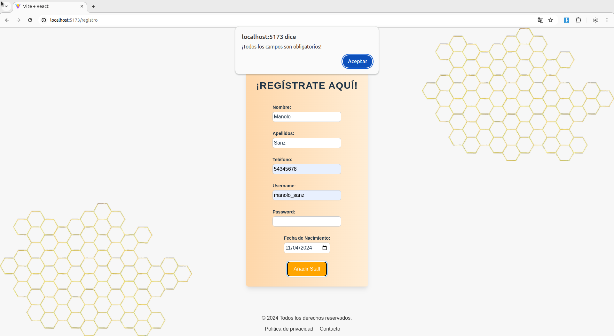
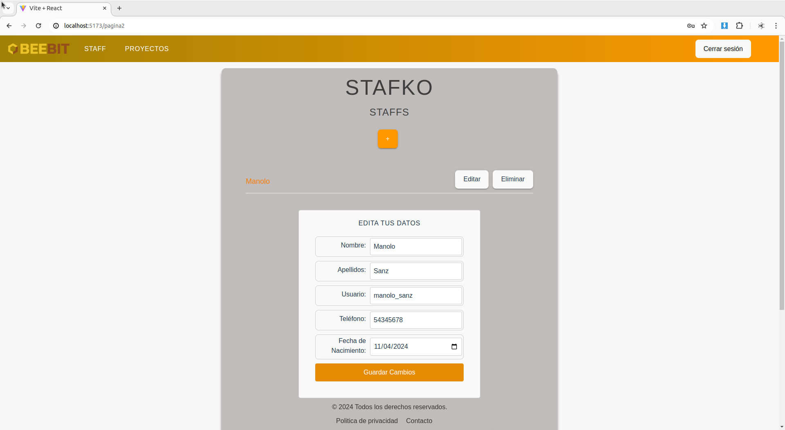

# STAFKO - MARIA SALVADOR CARDOSO

# Screenshots

# Login y registro

## Validación de formulario de registro

## Redirigimos al inicio de sesión en 3 segundos si el registro ha sido correcto

## Guardamos los datos de inicio de sesión en Cookie

# Proyectos

## Añadimos proyecto con validación de formulario

## Ningún campo puede quedar vacío y la fecha no puede ser anterior a la actual
## Deberemos elegir el staff al que le vamos a asignar el proyecto seleccionándolo en el desplegable

## Visualización de los datos de los proyectos

## Aplicamos filtro para visualizar Mis proyectos 

## Solo el usuario logueado podrá editar y eliminar sus proyectos

## Proyecto eliminado

# Staffs
## El usuario logueado aparecerá el primero y de color naranja

## Añadimso Staff con validación de formulario

## Podremos ver los datos del resto de los usuarios

## Solo el usuario logueado podrá editar su usuario y eliminar su cuenta

## Antes de eliminar la cuenta deberá confirmar la petición

## Si el usuario logueado tiene proyecto asignado no se podrá eliminar la cuenta

## Una vez eliminada la cuenta no podremos volver a acceder

## Al eliminar la cuenta se eliminará también la cookie y los datos de registro de la bd

# Pie de página
## Politica de privacidad

## Contacto y envío de correo

# Cerrar Sesión
## Se destruye la cookie

# ACTUALIZACIONES

## Copia de seguridad Backend

## En el caso de no tener los permisos se han cifrado los proyectos a los que han sido asociados los demás usuarios para una mayor privacidad además de un cambio de estilo en el color del Modal de cada sección

## Sección Cliente
### Contamos con dos tipos de usuarios, los Staffs y los Clientes.
### Si el usuario que se loguea es un Staff se habilitará el botón de + (agregar un nuevo usuario)

## Implementación Clockify

### Al validar los datos introducidos, antes de hacer login, se le pregunta al usuario la tarea en la que va a trabajar

### Esta tarea es enviada a Clockify, se añade a la descripción junto con el email de inicio sesión y automáticamente activa el contador con el proyecto en el que se está trabajando 

### Al hacer login va a salir un contador en cada pantalla para que el usuario siempre tenga conocimiento del tiempo que se ha dedicado a la tarea

### Al cerrar sesión ambos contadores se paran automáticamente y Clockify registra el tiempo de la tarea especificada junto con el usuario que la ha relaizado y su proyecto.

